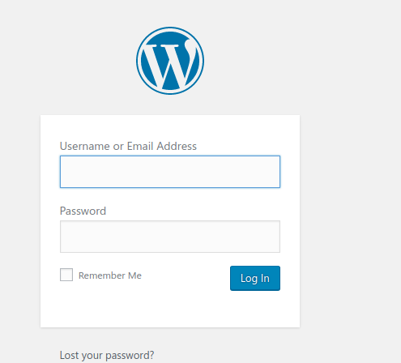
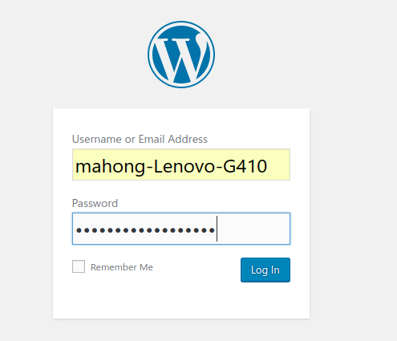
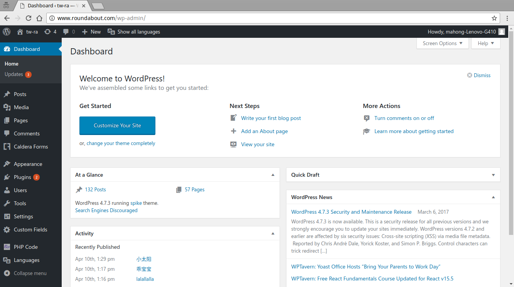
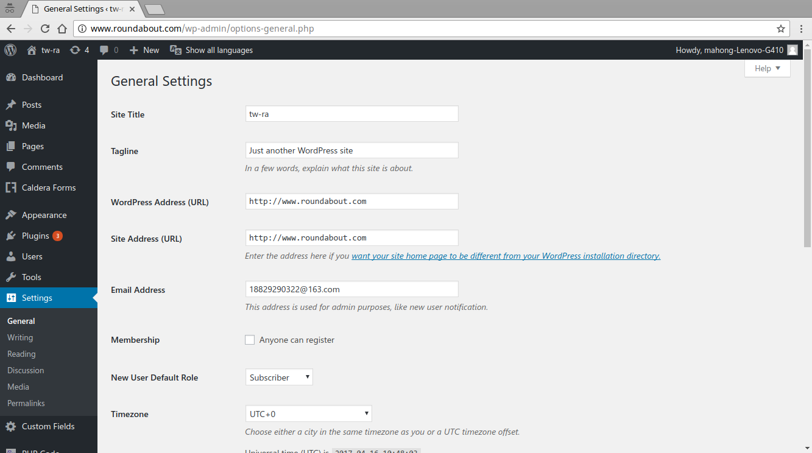

# round-about-deploy

> Ansible playbook for deploying Round-About to AWS instance.

This playbook will
- install docker and docker-compose
- setup Wordpress container
- setup MySQL container, restore website data.

## Prerequisite
- [Ansible](http://docs.ansible.com/ansible/intro_installation.html) version >= 2.3
- [Git](https://git-scm.com/downloads) version >=1.7.1

## Setup Configurations

Open `group_vars/all`, edit it as you want. Example is already there.

### Domain
```
# setup domain as what you want as below
domain: www.roundabout.com
```

### Database
```
# setup mysql configuration as below
DB_NAME: round_about
DB_ROOT_PASSWORD: round_about
DB_USER: round_about
DB_PASSWORD: round_about
```

### AWS IP
You need to add your AWS instance external IP into `inventory`, example is already there.
```
[remote]
# put your instance external IP here like follow
54.223.111.25

...
```

as instance, you may change the `inventory` like below
```
[remote]
66.111.23.123 # your instance ip

...
```


## Usage
after all, execute command as below.
```bash
$ ansible-playbook site.yml --private-key <private_key.pem> -i inventory -u ubuntu
```
> NOTE:
- private_key.pem is your AWS pem file, you should put it at this directory.
```bash
round-about-deploy
├── group_vars
├── inventory
├── private_key.pem  # put it under [round-about-deploy] directory
├── README.md
├── roles
└── site.yml
```

## Login
After finish deploying, you can login as admin by get browser request `www.roundabout.com/wp-admin`, then you'll see




Fill the login form with initialization account and password

```
- account:   mahong-Lenovo-G410
- password:  mahong-Lenovo-G410
```




Normally, you'll get into dashboard




You can change setup in settings page




